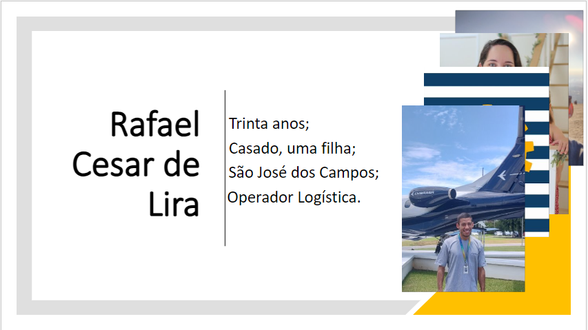
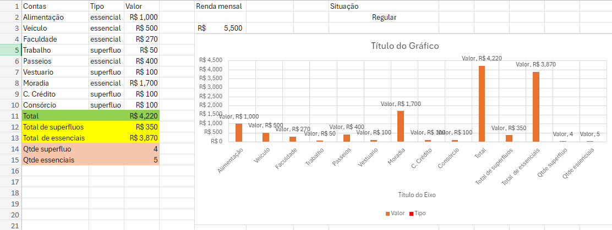
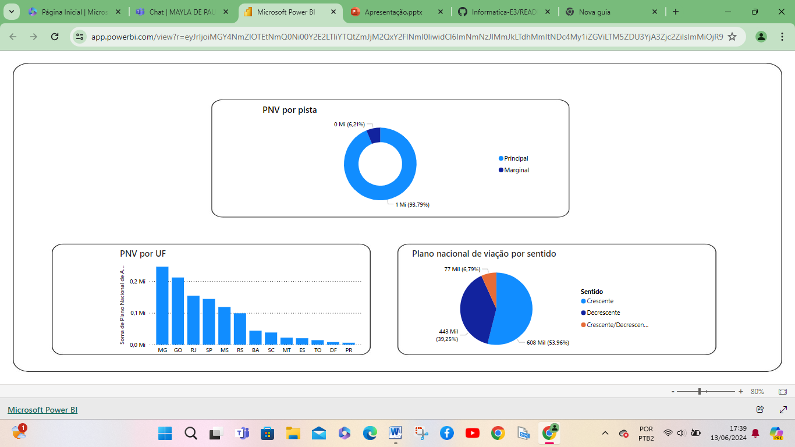

# Rafael Cesar 

Estudante Logística 1 FATEC.

# Atividades realizadas:

Power Point;
Exel;
Power BI;
Power Apps;

## Power Point:

<!-- ## Obrigado por acessar noso GitHub! :sparkles: -->

## Exel:

<!-- ## Obrigado por acessar noso GitHub! :sparkles: -->

## Power BI:

<!-- ## Obrigado por acessar noso GitHub! :sparkles: -->

## Power Apps:

<!-- ## Obrigado por acessar noso GitHub! :sparkles: -->

<!-- ## Obrigado por acessar noso GitHub! :sparkles: -->

<!-- ## Obrigado por acessar noso GitHub! :sparkles: -->

